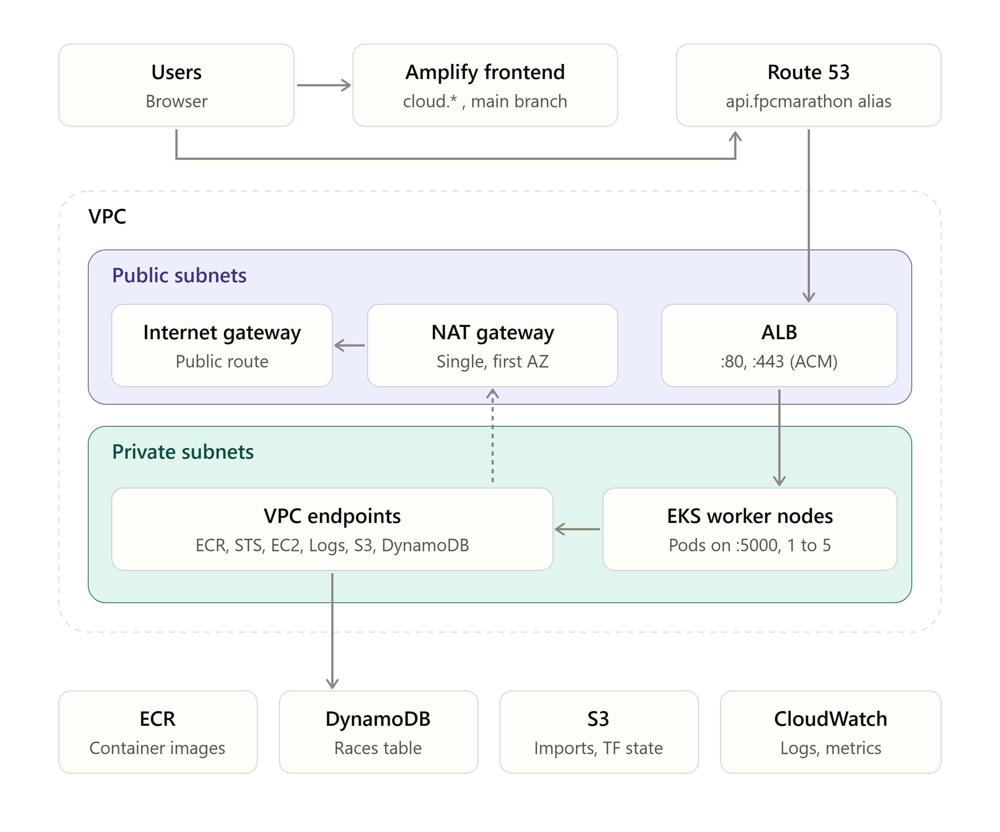
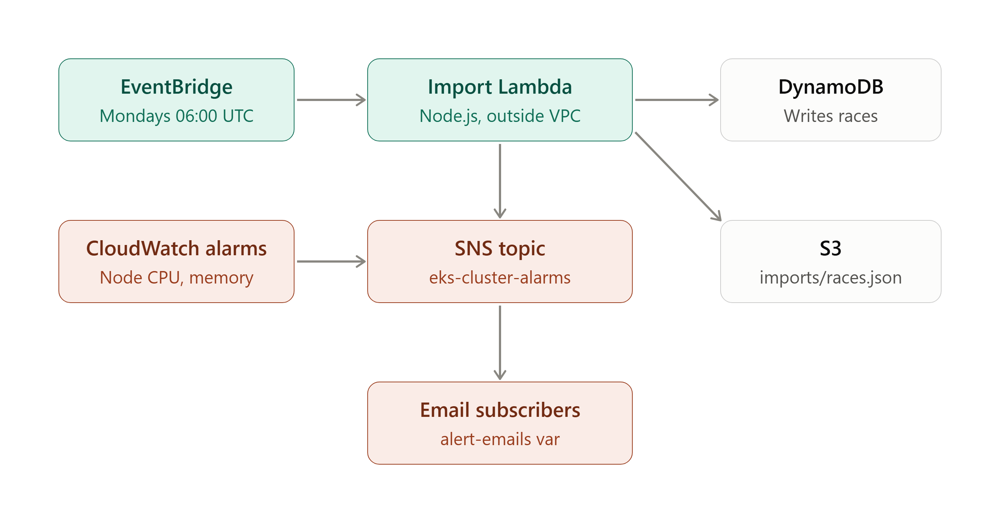

# Half Marathon Cloud Platform

El contingut principal es troba als següents directoris:

`platform`: conté les configuracions de Terraform per desplegar la infraestructura cloud necessària, així com la configuració per gestionar el clúster eks on viuen les nostres aplicacions

`backend`: conté el codi del backend de l'aplicació marathon-app, desenvolupat amb nodejs

`frontend`: conté el codi del frontend de l'aplicació marathon-app, desenvolupat amb javascript i angular

`kubernetes`: conté el helm chart de l'aplicació marathon-app

`lambdas`: conté el codi de les funcions lambda desplegades amb Terraform

### INFRAESTRUCTURA

La infraestructura, així per sobre, es la següent

