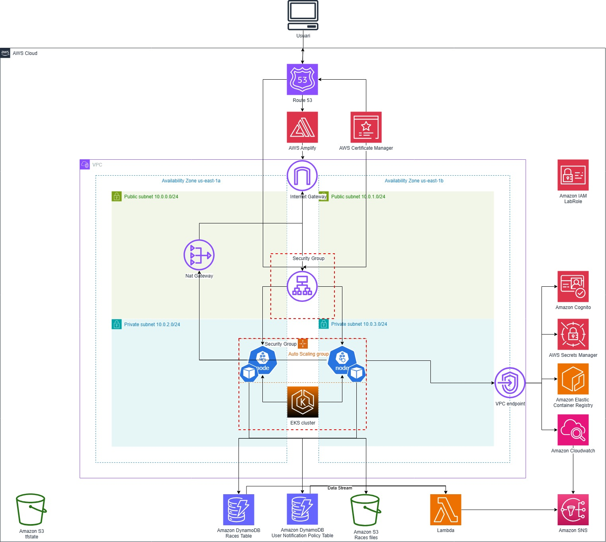

# Marathon Cloud Platform

## RESUM

## STORYTELLING

## REQUERIMENTS I OBJECTIUS

L'objectiu del projecte es implementar una infraestructura cloud on poder allotjar la nostra aplicació, Marathon Cloud Platform. Aquesta infraestructura estarà gestionada amb eines IaC, com Terraform, i basada en metodologies GitOps.

Per assolir el nostre objectiu es necessàri definir una infraestructura resilient i coherent amb el funcionament de la nostra aplicació i intergrar els diferents components i serveis de AWS correctament per poder oferir una plataforma en condicions.

El requeriments funcionals de la nostra aplicació són:
1. Llistar i interactuar amb les diferents curses emmagatzemades dins la infraestructura cloud
2. Oferir al usuari la possibilitat d'incorporar noves curses a l'aplicació
3. 
4. 

## AWS

Per al desenvolupament del projecte hem utilitzat el Learner Lab de AWS Academy. Un aspecte importat a tindre en compte és que la gran majoria dels serveis AWS desplegats amb Terraform depenen del _LabRole_ del que disposa aquest entorn. Qualsevol execució d'aquest codi fora del Learnen Lab requereix modificacions de codi, així com definir nous permisos i rols per cadascún dels recursos corresponents.

## Github

Hem utilitzat Git com a repositori font del nostre projecte. Tot el contingut es troba dins del seu directori corresponent.

`platform`: conté les configuracions de Terraform per desplegar la infraestructura cloud necessària, així com la configuració per gestionar el clúster eks on viuen les nostres aplicacions, en aquest cas, Marathon Cloud Platform.

`marathon-app`: conté el codi font de l'aplicació marathon app. Està dividit en dos directoris, _frontend_ i _backend_.

`marathon-app/backend`: conté el codi del backend de l'aplicació marathon-app, desenvolupat amb nodejs

`marathon-app/frontend`: conté el codi del frontend de l'aplicació marathon-app, desenvolupat amb javascript i angular

`kubernetes`: conté els diferents helm charts, en aquest cas, el de l'aplicació marathon-app

`lambdas`: conté el codi de les funcions lambda desplegades amb Terraform

`docs`: conté documentació del projecte

### INFRAESTRUCTURA

La infraestructura, es la següent

