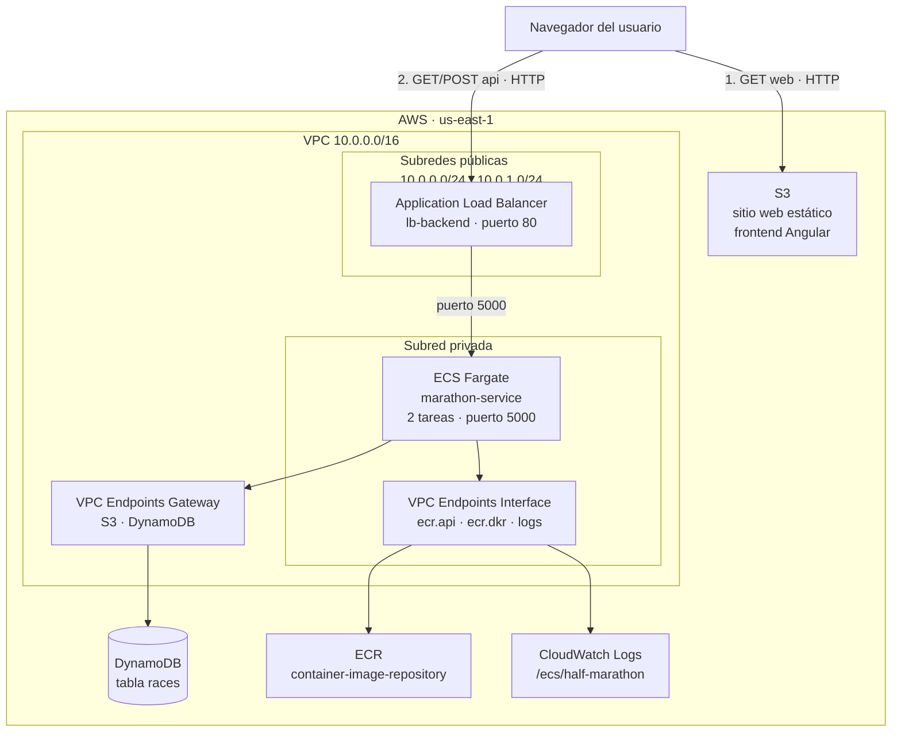

# Arquitectura

Documento de la arquitectura **realmente implementada y desplegada**. Todos los
nombres de recurso, rangos de red y parámetros que aparecen aquí se corresponden con
el código de `backend/infra/`.

---

## 1. Visión general

La plataforma sigue una arquitectura de tres capas desacopladas:

- **Presentación.** Una aplicación Angular compilada a archivos estáticos y servida
  desde un bucket de S3 configurado como sitio web. No hay servidor de aplicaciones:
  el navegador descarga los archivos y ejecuta la lógica en el cliente.
- **Aplicación.** Una API REST en Node.js + Express, empaquetada en un contenedor
  Docker y ejecutada en ECS Fargate. Está en una subred privada y solo es accesible
  a través de un Application Load Balancer.
- **Datos.** Una tabla de DynamoDB, a la que el backend accede por la red privada de
  AWS mediante un VPC endpoint, sin salir a internet.

La separación es real, no nominal: cada capa se despliega, escala y falla de forma
independiente.



---

## 2. Componentes

### 2.1 Red (VPC)

| Recurso | Configuración |
|---|---|
| VPC | `10.0.0.0/16`, con resolución y nombres DNS habilitados |
| Subredes públicas | `10.0.0.0/24` en `us-east-1a`, `10.0.1.0/24` en `us-east-1b` |
| Subredes privadas | `10.0.2.0/24` en `us-east-1a`, `10.0.3.0/24` en `us-east-1b` |
| Internet Gateway | Asociado a la tabla de rutas pública (`0.0.0.0/0` → IGW) |
| Tabla de rutas privada | **Sin ruta a internet** |

Tanto las subredes públicas como las privadas se despliegan una por zona de
disponibilidad, recorriendo la lista `var.aws-availability-zones` mediante `count`.
Con una sola subred privada, las dos tareas del servicio acabarían en la misma zona
y la redundancia solo protegería del fallo de una tarea, no de una zona.

La decisión de diseño relevante está en la última fila: la subred privada no tiene
salida a internet, ni por Internet Gateway ni por NAT Gateway. El backend está
completamente aislado.

Eso obliga a resolver de otro modo el acceso a los servicios de AWS que el backend
necesita, y de ahí vienen los VPC endpoints.

### 2.2 VPC Endpoints

Un VPC endpoint es una puerta privada hacia un servicio de AWS: el tráfico viaja por
la red interna de Amazon sin pasar por internet. Hay dos tipos, y aquí se usan los dos.

| Endpoint | Tipo | Para qué | Coste |
|---|---|---|---|
| `com.amazonaws.us-east-1.s3` | Gateway | Acceso a S3 desde la subred privada | Gratuito |
| `com.amazonaws.us-east-1.dynamodb` | Gateway | **Acceso del backend a la base de datos** | Gratuito |
| `com.amazonaws.us-east-1.ecr.api` | Interface | Consultar el registro de imágenes | ~0,48 USD/día |
| `com.amazonaws.us-east-1.ecr.dkr` | Interface | Descargar la imagen del contenedor | ~0,48 USD/día |
| `com.amazonaws.us-east-1.logs` | Interface | Enviar logs a CloudWatch | ~0,48 USD/día |

Los de tipo **Gateway** se implementan como entradas en la tabla de rutas y no cuestan
nada. Los de tipo **Interface** crean una interfaz de red real dentro de cada subred y
se facturan por hora, aunque no se usen.

**Y se facturan por zona de disponibilidad.** Al desplegar el backend en dos zonas,
cada endpoint de tipo Interface crea dos interfaces de red en lugar de una, de modo
que su coste se duplica: los tres juntos pasan de 0,72 a **1,44 USD diarios**, por
encima del balanceador. Es el precio concreto de la alta disponibilidad.

Los tres de Interface existen porque las tareas Fargate necesitan descargar su imagen
de ECR y escribir logs, y no tienen otra vía sin salida a internet. Es un compromiso
consciente entre aislamiento de red y coste: ver
[`mejoras-propuestas.md`](mejoras-propuestas.md), punto 12.

### 2.3 Grupos de seguridad

Los grupos de seguridad forman una cadena en la que cada capa solo acepta tráfico de
la anterior. No se usan rangos de IP entre capas, sino referencias entre grupos, que
es la práctica correcta.

| Grupo | Entrada permitida | Origen |
|---|---|---|
| `ecs-alb-sg` | Puertos 80 y 443 | `0.0.0.0/0` (internet) |
| `ecs-service-sg` | Puerto 5000 | Únicamente `ecs-alb-sg` |
| `vpc-endpoints-sg` | Puerto 443 | Únicamente `ecs-service-sg` |

Consecuencia práctica: **es imposible alcanzar el backend directamente desde
internet**, incluso conociendo su dirección IP privada. La única entrada es el
balanceador.

El grupo del balanceador acepta el puerto 443, pero no hay ningún listener escuchando
ahí. Es una previsión para cuando se añada HTTPS.

### 2.4 Balanceador (ALB)

| Parámetro | Valor |
|---|---|
| Nombre | `lb-backend` |
| Tipo | Application Load Balancer, `internal = false` (público) |
| Subredes | Las dos públicas, una por zona de disponibilidad |
| Listener | Puerto 80, protocolo HTTP |
| Target group | `tg-backend`, puerto 5000, HTTP, `target_type = ip` |

El `target_type = ip` es obligatorio con Fargate: las tareas no tienen instancia
asociada, así que se registran por su dirección IP dentro de la VPC.

El nombre DNS del balanceador lo asigna AWS y **cambia en cada creación**. Es la causa
de que la URL del frontend tenga que actualizarse en cada despliegue.

El balanceador es también el recurso más lento de crear: unos **3 minutos**, frente a
segundos del resto.

### 2.5 Contenedor y registro (ECR)

El backend se empaqueta con este `Dockerfile`:

```dockerfile
FROM node:24.16-alpine
WORKDIR /api
COPY package*.json /api/
RUN npm install
COPY server.js db.js /api/
USER node
EXPOSE 5000
CMD ["npm", "start"]
```

Dos aspectos correctos: se usa una imagen `alpine` (mínima) y el proceso **no corre
como root** (`USER node`), que es una buena práctica de seguridad de contenedores.

La imagen se sube al repositorio ECR `container-image-repository` con la etiqueta
`v1.0`, fijada en el código de Terraform. Cada nueva versión sobrescribe la anterior,
por lo que no existe historial ni posibilidad de rollback.

### 2.6 Cómputo (ECS Fargate)

| Recurso | Nombre | Configuración |
|---|---|---|
| Cluster | `marathon-cluster` | — |
| Task definition | `marathon-task` | Fargate, 512 CPU (0,5 vCPU), 1024 MB, Linux/X86_64 |
| Contenedor | `backend` | Puerto 5000/tcp, logs a `/ecs/half-marathon` |
| Service | `marathon-service` | 2 tareas, subred privada, `assign_public_ip = false` |

**Por qué Fargate y no EC2.** Con Fargate no existe ninguna máquina virtual que
aprovisionar, parchear o dimensionar: se declara cuánta CPU y memoria necesita cada
tarea y AWS se encarga del resto. Elimina toda la gestión de servidores a cambio de un
precio por hora algo superior.

**El rol de IAM.** Tanto `execution_role_arn` como `task_role_arn` apuntan a `LabRole`,
un rol preexistente del laboratorio de AWS Academy. Cumplen funciones distintas —el de
ejecución permite a ECS descargar la imagen y escribir logs; el de tarea permite al
código acceder a DynamoDB— y en un entorno real serían dos roles separados con
permisos mínimos. Aquí es el mismo rol amplio porque es el único disponible.

Esta dependencia hace que **el proyecto no sea portable a una cuenta de AWS
convencional** sin sustituir esa referencia.

**Las dos réplicas.** El servicio mantiene dos tareas y recibe la lista completa de
subredes privadas (`aws_subnet.private[*].id`), una por zona de disponibilidad. ECS
distribuye las tareas entre las subredes disponibles, de modo que la redundancia
protege tanto del fallo de una tarea como del fallo de una zona completa.

El coste de esta decisión no está en Fargate, que se paga por tarea con independencia
de dónde se ubique, sino en los VPC endpoints de tipo Interface, que se facturan por
zona: ver el apartado 2.2.

### 2.7 Base de datos (DynamoDB)

| Parámetro | Valor |
|---|---|
| Tabla | `races` |
| Clave de partición | `id`, tipo `String` |
| Modo de facturación | `PAY_PER_REQUEST` (bajo demanda) |
| Índices secundarios | Ninguno |

**Modelo de datos.** Cada elemento contiene `id`, `name`, `city`, `country`, `date`
(cadena `YYYY-MM-DD`) y `distance` (número, en kilómetros). DynamoDB no impone
esquema: la estructura la garantiza el backend, no la base de datos.

**El identificador** se genera en el código como `${Date.now()}-${aleatorio}`. Funciona
para el volumen del proyecto, pero no es un identificador único garantizado
formalmente; un UUID lo sería.

**La ausencia de índices secundarios es la limitación estructural más relevante.** Con
solo la clave de partición, la única consulta eficiente es "dame la carrera con este
`id`". Cualquier búsqueda por ciudad, país o distancia obliga a un `Scan`, que lee la
tabla completa y descarta después. Filtrar en el servidor con `FilterExpression` **no
ahorra lectura**, solo tráfico de red.

Para que las búsquedas escalaran habría que crear índices secundarios globales (GSI)
por los campos consultados.

`PAY_PER_REQUEST` significa que no se paga capacidad reservada, solo las operaciones
realizadas. Con el uso del proyecto el coste es de céntimos.

### 2.8 Hosting del frontend (S3)

| Parámetro | Valor |
|---|---|
| Bucket | `marathon-cloudupc-website` |
| Documento índice | `index.html` |
| Documento de error | `index.html` |
| Acceso público | Permitido mediante política de bucket (`s3:GetObject` para `*`) |

**Por qué el documento de error es también `index.html`.** Angular es una aplicación
de página única: rutas como `/dashboard` no corresponden a ningún archivo en el
bucket. Cuando S3 no encuentra el archivo devuelve el error 404 con el contenido de
`index.html`, y entonces el router de Angular resuelve la ruta en el navegador. Es el
truco estándar para servir aplicaciones SPA desde almacenamiento estático.

**El bucket es público a propósito**, lo cual es correcto para un sitio web, pero
implica que todo lo que se suba será accesible por internet. Por eso importa que la
compilación no incluya código fuente (ver `angular.json`, bloque `assets`).

**El nombre del bucket es fijo en el código.** Los nombres de bucket de S3 son únicos
a nivel mundial, no por cuenta, así que solo un integrante del equipo puede tener la
infraestructura desplegada a la vez.

---

## 3. Flujos

### 3.1 Cargar la lista de carreras

```
1. El navegador pide http://<bucket>.s3-website-us-east-1.amazonaws.com
2. S3 devuelve index.html, el bundle JavaScript y los estilos
3. Angular arranca y el DashboardComponent llama a RaceService.getRaces()
4. Se emite GET http://<alb>/races
5. El listener del ALB en el puerto 80 reenvía al target group
6. El target group entrega la petición a una de las dos tareas, puerto 5000
7. Express ejecuta un ScanCommand sobre la tabla races
8. La petición sale por el VPC endpoint Gateway de DynamoDB, sin tocar internet
9. DynamoDB devuelve los elementos, paginando si superan 1 MB
10. El backend responde JSON, el ALB lo reenvía y Angular pinta las tarjetas
```

El paso 9 está contemplado en el código: DynamoDB devuelve como máximo 1 MB por
respuesta, y el backend itera con `ExclusiveStartKey` hasta agotar los resultados.

### 3.2 Registrar una carrera

```
1. El usuario rellena el formulario en /add-race
2. AddRaceComponent valida los seis campos en el navegador
3. Se emite POST http://<alb>/races con el JSON
4. El backend genera el id y ejecuta un PutCommand
5. Responde {"status":"ok"} y el frontend redirige al dashboard tras 2 segundos
```

La validación existe solo en el cliente. **El backend no valida el cuerpo de la
petición**: una llamada directa a la API puede crear una carrera con campos vacíos o
con tipos incorrectos.

### 3.3 Filtrado

El filtrado se realiza **en el navegador**, no en el servidor. El dashboard descarga el
catálogo completo una vez y aplica los filtros de búsqueda, país y distancia sobre esa
copia en memoria (`filteredRaces`, un `computed` de Angular).

La consecuencia es que la respuesta al filtrar es instantánea, a costa de transferir
todo el catálogo al inicio. El backend implementa filtrado por parámetros, pero el
frontend no lo utiliza.

---

## 4. Estrategia de despliegue

El despliegue tiene una dependencia que Terraform no puede resolver por sí solo: el
servicio ECS necesita que la imagen exista en ECR **antes** de arrancar, pero la imagen
se sube con Docker, fuera de Terraform.

Se resuelve con un despliegue en dos fases, controlado por la variable `enable-ECS`:

```
Fase 1  enable-ECS = false   Red, DynamoDB, ECR, S3, ALB, grupos de seguridad
        docker build + push  La imagen queda disponible en el registro
Fase 2  enable-ECS = true    Cluster, task definition y service
```

Si se omite la separación, las tareas fallan con `CannotPullContainerError`.

El script `deploy.ps1` de la raíz automatiza las dos fases más la publicación del
frontend y la carga de datos, y espera activamente a que el backend responda antes de
continuar.

Alternativas más limpias a este mecanismo, en
[`mejoras-propuestas.md`](mejoras-propuestas.md), punto 5.

---

## 5. Seguridad

**Lo que está bien resuelto**

- El backend no es accesible desde internet: subred privada, sin IP pública, y grupos
  de seguridad encadenados por referencia en lugar de por rangos de IP.
- El tráfico hacia DynamoDB, ECR y CloudWatch no sale a internet: viaja por VPC
  endpoints.
- El contenedor no ejecuta como root.
- Ninguna credencial está escrita en el código: el acceso a DynamoDB se obtiene del
  rol de IAM de la tarea.

**Lo que no**

- **Todo el tráfico va sin cifrar.** El sitio web de S3 solo soporta HTTP y el
  balanceador solo tiene listener en el puerto 80. Cualquiera en la ruta de red puede
  leer las peticiones.
- **CORS está completamente abierto.** `app.use(cors())` sin parámetros permite
  peticiones desde cualquier origen. Debería restringirse al dominio del frontend.
- **La API no tiene autenticación.** Cualquiera puede crear carreras. El
  `package.json` incluye `jsonwebtoken` y el código tiene comentarios previendo
  usuarios, pero no está implementado.
- **El backend no valida las entradas.** La validación vive solo en el frontend, que
  es evitable llamando directamente a la API.
- **Un único rol de IAM muy amplio** (`LabRole`) para ejecución y para tarea, en lugar
  de dos roles con permisos mínimos.

---

## 5.bis. Integración continua y despliegue

El repositorio incluye dos pipelines de GitHub Actions con responsabilidades separadas.

**`ci.yml`, automático.** Se ejecuta en cada `push` a `main` y en cada *pull request*.
No requiere credenciales de AWS, por lo que funciona siempre. Valida la configuración
de Terraform (`init -backend=false` y `validate`), compila el frontend y construye la
imagen del backend analizándola con Trivy.

Incorpora una **guarda de regresión**: tras compilar el frontend cuenta los archivos
`.ts` presentes en la salida y falla si encuentra alguno, impidiendo que reaparezca el
defecto por el que el código fuente acabó publicado en el bucket público.

**`deploy.yml`, manual.** Despliega la aplicación sobre una infraestructura existente.
Publica la imagen en ECR con doble etiqueta (`v1.0`, que es la referencia fija de la
definición de tarea, y el hash abreviado del commit para trazabilidad), fuerza el
redespliegue del servicio, espera a que la API responda, y publica el frontend.

Las dos razones por las que el despliegue no es continuo son estructurales:

- **Credenciales temporales.** Las del laboratorio caducan cada pocas horas, de modo
  que un despliegue en cada cambio fallaría la mayor parte del tiempo.
- **Estado local de Terraform.** El pipeline no tiene acceso al estado, por lo que no
  puede crear ni modificar la infraestructura. Localiza los recursos existentes
  consultando la API de AWS (`describe-repositories`, `describe-load-balancers`) en
  lugar de leer los *outputs* de Terraform.

La segunda razón es también una separación de responsabilidades correcta: el pipeline
despliega la aplicación, la infraestructura se aprovisiona aparte.

---

## 6. Observabilidad

Las tareas escriben en el grupo de logs `/ecs/half-marathon` de CloudWatch, con el
prefijo `ecs`. La creación del grupo es automática (`awslogs-create-group = true`).

No hay métricas personalizadas, ni alarmas, ni trazas distribuidas. Están disponibles
las métricas estándar de ECS y del balanceador.

El backend expone dos endpoints de diagnóstico: `/` como health check simple y
`/connection`, que verifica la conectividad real con DynamoDB ejecutando un `Scan`
limitado a un elemento. El frontend usa el primero para el indicador *Service Online*.

Nota: el target group del balanceador **no define un health check explícito**, así que
usa el de por defecto (`GET /`, esperando un 200). Funciona porque la raíz devuelve
`{"status":"ok"}`, pero convendría declararlo de forma explícita.

---

## 7. Coste

Estimaciones para `us-east-1`, con la infraestructura levantada e inactiva:

| Recurso | Coste diario aprox. |
|---|---|
| 3 VPC endpoints de tipo Interface, en 2 zonas | 1,44 USD |
| 2 tareas Fargate (1 vCPU y 2 GB en total) | 1,20 USD |
| Application Load Balancer | 0,54 USD |
| DynamoDB, S3, ECR, endpoints Gateway | céntimos |
| **Total** | **~3,12 USD/día** |

Nótese que el gasto principal no es el cómputo ni el balanceo, sino la conectividad
privada. Es una consecuencia directa de dos decisiones de arquitectura: aislar la
subred privada de internet, y desplegarla en dos zonas de disponibilidad.

Son precios públicos de referencia, no facturación real: el dato exacto está en Cost
Explorer.

Dos consideraciones importantes:

- **Detener la sesión del laboratorio no detiene el gasto.** Fargate, el balanceador y
  los VPC endpoints siguen facturando. Solo `terraform destroy` lo lleva a cero.
- **Cada integrante despliega una infraestructura independiente**, porque el estado de
  Terraform es local. Varios despliegues simultáneos multiplican el coste.

---

## 8. Limitaciones y trabajo futuro

| Limitación | Solución | Complejidad |
|---|---|---|
| Sin HTTPS | CloudFront delante del bucket + certificado de ACM en el ALB | Alta: requiere un dominio propio para validar el certificado |
| Búsquedas mediante `Scan` | Índices secundarios globales por ciudad y país | Media |
| Sin paginación | Paginar en la API y en el frontend | Media |
| Sin autenticación | Cognito, o JWT propio con la dependencia ya presente | Media |
| Sin pruebas | Vitest ya está instalado en el frontend | Baja |
| Despliegue no continuo | Backend remoto para el estado + credenciales estables | Media |
| Nombre de bucket fijo | Incorporar el identificador de cuenta al nombre | Baja |
| Dependencia de `LabRole` | Definir roles propios con permisos mínimos | Media |
| Sin asistente de IA | Ver el apartado 9 | No viable en el laboratorio |

El detalle de cada punto, con el código concreto de la solución y el esfuerzo
estimado, está en [`mejoras-propuestas.md`](mejoras-propuestas.md).

---

## 9. Amazon Bedrock: análisis de viabilidad

El planteamiento inicial del proyecto contemplaba, como funcionalidad opcional, un
asistente conversacional basado en Amazon Bedrock. Se evaluó su incorporación y se
descartó. Se documenta el análisis porque las razones son de tres naturalezas
distintas y ninguna es la falta de tiempo.

### 9.1. Diseño previsto

La funcionalidad habría consistido en una búsqueda en lenguaje natural: el usuario
escribe *"medias maratones en España en primavera"* y el sistema traduce la frase a
los filtros correspondientes.

```
Interfaz  ->  POST /assistant  ->  Bedrock InvokeModel
                                   (catálogo como contexto)
                                        |
                                        v
                            filtros estructurados -> DynamoDB
```

Habría requerido un endpoint nuevo en la API, la dependencia
`@aws-sdk/client-bedrock-runtime`, permiso `bedrock:InvokeModel` en el rol de tarea, y
un componente de entrada de texto en el dashboard.

### 9.2. Impedimento 1: permisos del rol de usuario

La consulta del catálogo de modelos disponibles se rechaza:

```
AccessDeniedException: User ... is not authorized to perform:
bedrock:ListFoundationModels because no identity-based policy
allows the bedrock:ListFoundationModels action
```

Nótese la formulación: no existe una denegación explícita, sino ausencia de
autorización. El servicio no forma parte del conjunto habilitado en el laboratorio.

### 9.3. Impedimento 2: imposibilidad de auditar el rol de tarea

El backend no se ejecuta con el rol del usuario, sino con `LabRole`, de modo que en
principio sus permisos podrían diferir. La consulta de las políticas asociadas revela
cuatro políticas gestionadas de AWS (`AmazonSSMManagedInstanceCore`,
`AmazonEKSClusterPolicy`, `AmazonEC2ContainerRegistryReadOnly`,
`AmazonEKSWorkerNodePolicy`) y tres políticas propias del laboratorio.

Ninguna de las gestionadas concede acceso a Bedrock. El contenido de las tres propias
no puede inspeccionarse:

```
AccessDenied: ... not authorized to perform: iam:GetPolicy ...
with an explicit deny in an identity-based policy: .../Pvoclabs1
```

Aquí sí hay denegación explícita. La verificación es por tanto imposible por vía
documental.

### 9.4. Impedimento 3: obstáculo arquitectónico

Este es el hallazgo más relevante, por ser independiente de los permisos.

Las tareas se ejecutan en una subred privada **sin salida a internet**. Los servicios
de AWS se alcanzan mediante VPC endpoints, y Bedrock —a diferencia de S3 y
DynamoDB— **no dispone de endpoint de tipo Gateway**, que son los gratuitos.

La integración exigiría por tanto un endpoint de tipo Interface adicional para
`bedrock-runtime`, con un coste de 0,24 USD diarios por zona de disponibilidad: **0,48
USD diarios** con la configuración de dos zonas, un 15 % sobre la factura actual.

Como consecuencia, tampoco existe una prueba empírica económica: desde la subred
privada la invocación fracasaría por tiempo de espera de red con independencia de los
permisos, resultado indistinguible de una denegación. Determinar la causa real exigiría
crear previamente el endpoint.

### 9.5. Conclusión

La funcionalidad se descarta por limitación del entorno, no por decisión de alcance.
Su incorporación en un entorno sin restricciones requeriría: habilitar el acceso al
modelo en la cuenta, conceder `bedrock:InvokeModel` al rol de tarea, añadir el VPC
endpoint de `bedrock-runtime`, e implementar el endpoint y el componente descritos en
el apartado 9.1.
