# Gantt — Half Marathon Cloud Platform

## Project Timeline

```mermaid
gantt
    title Half Marathon Cloud Platform - Project Gantt
    dateFormat  YYYY-MM-DD
    axisFormat  %d/%m

    section Phase 0 - Preparation
    Create GitHub repository                      :done, itzel_repo, 2026-06-18, 2026-06-20
    Create initial repository structure           :done, itzel_structure, 2026-06-18, 2026-06-20
    Create initial README                         :done, itzel_readme, 2026-06-20, 2026-06-21
    Create project overview document              :active, itzel_overview, 2026-06-21, 2026-06-22
    Create team responsibilities document         :itzel_team, 2026-06-22, 2026-06-23
    Create planning document                      :itzel_planning, 2026-06-23, 2026-06-24
    Confirm tech stack                            :team_stack, 2026-06-24, 2026-06-24
    Confirm owners and responsibilities           :team_owners, 2026-06-24, 2026-06-24
    Define initial database model                 :miquel_javi_db_model, 2026-06-25, 2026-06-26
    Define initial API contract                   :javi_xavi_itzel_api, 2026-06-26, 2026-06-27
    Define initial AWS architecture               :oscar_itzel_aws, 2026-06-27, 2026-06-28
    Create GitHub issues                          :itzel_issues, 2026-06-28, 2026-06-29
    Kickoff review                                :team_kickoff, 2026-06-30, 2026-06-30

    section Phase 1 - Functional Definition and Architecture
    Define MVP functionalities                    :team_mvp, 2026-07-01, 2026-07-02
    Validate general architecture                 :itzel_oscar_arch, 2026-07-01, 2026-07-02
    Create architecture diagram                   :itzel_diagram, 2026-07-02, 2026-07-03
    Define user flow                              :itzel_xavi_flow, 2026-07-02, 2026-07-03
    Define minimum API endpoints                  :javi_xavi_api, 2026-07-03, 2026-07-04
    Define main database tables                   :miquel_javi_tables, 2026-07-03, 2026-07-04
    Validate repository structure                 :team_repo_review, 2026-07-05, 2026-07-05
    Create working branches                       :team_branches, 2026-07-05, 2026-07-05

    section Phase 2 - Database Model and Backend Base
    Create database schema.sql                    :miquel_schema, 2026-07-06, 2026-07-08
    Create database seed.sql                      :miquel_seed, 2026-07-08, 2026-07-09
    Document database model                       :miquel_itzel_db_docs, 2026-07-09, 2026-07-10
    Create Node.js Express project                :javi_backend_init, 2026-07-06, 2026-07-08
    Create backend structure                      :javi_backend_structure, 2026-07-08, 2026-07-09
    Create GET /health endpoint                   :javi_health, 2026-07-09, 2026-07-09
    Create GET /races with mock data              :javi_races_mock, 2026-07-10, 2026-07-11
    Create React Vite base project                :xavi_frontend_init, 2026-07-10, 2026-07-11
    Create Terraform base structure               :oscar_tf_base, 2026-07-10, 2026-07-12
    Weekly review                                 :team_review_1, 2026-07-12, 2026-07-12

    section Phase 3 - Backend Connected to PostgreSQL
    Set up local PostgreSQL                       :miquel_javi_postgres, 2026-07-13, 2026-07-14
    Load schema and seed data                     :miquel_load_data, 2026-07-14, 2026-07-15
    Create backend DB connection                  :javi_db_connection, 2026-07-15, 2026-07-16
    Implement real GET /races                     :javi_get_races, 2026-07-16, 2026-07-17
    Implement GET /races/:id                      :javi_get_race_id, 2026-07-17, 2026-07-18
    Implement city filter                         :javi_city_filter, 2026-07-17, 2026-07-18
    Document API JSON responses                   :javi_itzel_api_docs, 2026-07-18, 2026-07-19
    Create initial React components               :xavi_components, 2026-07-17, 2026-07-19

    section Phase 4 - Frontend Connected to Local API
    Create frontend API service                   :xavi_itzel_api_service, 2026-07-20, 2026-07-21
    Create Home page                              :xavi_home, 2026-07-21, 2026-07-22
    Create city search                            :xavi_search, 2026-07-22, 2026-07-23
    Create races list                             :xavi_races_list, 2026-07-23, 2026-07-24
    Create race detail page                       :xavi_race_detail, 2026-07-24, 2026-07-25
    Implement date filter in API                  :javi_date_filter, 2026-07-24, 2026-07-25
    Validate local frontend/API integration       :itzel_xavi_javi_local, 2026-07-25, 2026-07-26
    Document frontend to backend flow             :itzel_flow_docs, 2026-07-26, 2026-07-26

    section Phase 5 - Docker, ECR and Kubernetes Base
    Create backend Dockerfile                     :javi_dockerfile, 2026-07-27, 2026-07-28
    Test Docker image locally                     :javi_docker_test, 2026-07-28, 2026-07-29
    Define image tagging strategy                 :itzel_javi_tags, 2026-07-29, 2026-07-29
    Create Terraform ECR module                   :oscar_itzel_ecr, 2026-07-29, 2026-07-30
    Define ECR read/write IAM policy              :oscar_itzel_ecr_rw, 2026-07-30, 2026-07-31
    Define ECR read-only IAM policy               :oscar_itzel_ecr_ro, 2026-07-30, 2026-07-31
    Create Kubernetes namespace.yaml              :itzel_ns, 2026-08-01, 2026-08-01
    Create Kubernetes deployment.yaml base        :itzel_deploy_base, 2026-08-01, 2026-08-01
    Create Kubernetes service.yaml base           :itzel_service_base, 2026-08-02, 2026-08-02
    Document Docker to ECR to EKS flow            :itzel_deploy_docs, 2026-08-02, 2026-08-02

    section Phase 6 - AWS Infrastructure with Terraform
    Create VPC module                             :oscar_vpc, 2026-08-03, 2026-08-04
    Create public and private subnets             :oscar_subnets, 2026-08-03, 2026-08-04
    Create Security Groups                        :oscar_sg, 2026-08-04, 2026-08-05
    Create S3 module                              :oscar_s3, 2026-08-04, 2026-08-05
    Create RDS module                             :oscar_rds, 2026-08-05, 2026-08-06
    Create ECR module                             :oscar_itzel_ecr_module, 2026-08-05, 2026-08-06
    Create IAM module                             :oscar_iam, 2026-08-06, 2026-08-07
    Create CloudWatch module                      :oscar_cloudwatch, 2026-08-06, 2026-08-07
    Create Secrets Manager module                 :oscar_secrets, 2026-08-07, 2026-08-08
    Review Terraform outputs                      :oscar_itzel_outputs, 2026-08-08, 2026-08-09
    Document AWS infrastructure                   :itzel_oscar_aws_docs, 2026-08-09, 2026-08-09

    section Phase 7 - EKS and Kubernetes Deployment
    Create EKS module in Terraform                :oscar_eks_module, 2026-08-10, 2026-08-11
    Create EKS cluster                            :oscar_eks_cluster, 2026-08-10, 2026-08-11
    Push backend image to ECR                     :itzel_javi_ecr_push, 2026-08-11, 2026-08-12
    Complete deployment.yaml with ECR image       :itzel_deployment, 2026-08-12, 2026-08-13
    Create configmap.yaml                         :itzel_configmap, 2026-08-13, 2026-08-13
    Create secret.example.yaml                    :itzel_secret, 2026-08-13, 2026-08-14
    Create ingress.yaml                           :itzel_oscar_ingress, 2026-08-14, 2026-08-15
    Create hpa.yaml                               :itzel_hpa, 2026-08-15, 2026-08-15
    Validate backend pods                         :itzel_javi_pods, 2026-08-16, 2026-08-16
    Validate backend to RDS connection            :itzel_javi_oscar_rds, 2026-08-16, 2026-08-16

    section Phase 8 - Final AWS Integration
    Get public API URL                            :itzel_oscar_api_url, 2026-08-17, 2026-08-17
    Configure VITE_API_URL in frontend            :xavi_itzel_vite, 2026-08-17, 2026-08-18
    Build React frontend                          :xavi_build, 2026-08-18, 2026-08-19
    Upload frontend to S3                         :xavi_oscar_s3_upload, 2026-08-19, 2026-08-20
    Configure CloudFront                          :oscar_cloudfront, 2026-08-20, 2026-08-21
    Upload sample route files to S3               :miquel_routes_s3, 2026-08-20, 2026-08-21
    Validate S3 route references in RDS           :miquel_javi_routes, 2026-08-21, 2026-08-22
    Test end-to-end flow                          :team_e2e, 2026-08-22, 2026-08-22
    Fix integration issues                        :team_fixes, 2026-08-22, 2026-08-23

    section Phase 9 - CI/CD, Security, Lambda and Documentation
    Create backend-ci.yml                         :itzel_javi_backend_ci, 2026-08-24, 2026-08-24
    Create frontend-ci.yml                        :itzel_xavi_frontend_ci, 2026-08-24, 2026-08-24
    Create terraform-plan.yml                     :itzel_oscar_tf_ci, 2026-08-25, 2026-08-25
    Create docker-build-push.yml                  :itzel_javi_docker_ci, 2026-08-25, 2026-08-26
    Create trivy-scan.yml                         :itzel_trivy, 2026-08-26, 2026-08-26
    Generate SBOM with Trivy                      :itzel_sbom, 2026-08-27, 2026-08-27
    Upload SBOM to Dependency-Track               :itzel_oscar_dependency_track, 2026-08-27, 2026-08-27
    Create basic import-races Lambda              :javi_miquel_lambda, 2026-08-27, 2026-08-28
    Configure S3 to Lambda trigger                :oscar_javi_s3_lambda, 2026-08-28, 2026-08-28
    Document CSV to Lambda to RDS flow            :itzel_miquel_lambda_docs, 2026-08-28, 2026-08-29
    Review CloudWatch logs                        :oscar_itzel_logs, 2026-08-29, 2026-08-29
    Document CI/CD and security                   :itzel_cicd_docs, 2026-08-29, 2026-08-30
    Prepare demo script                           :itzel_demo_script, 2026-08-30, 2026-08-31
    Prepare final presentation                    :team_presentation, 2026-08-30, 2026-08-31

    section Phase 10 - Final Review
    Final system review                           :team_final_review, 2026-09-01, 2026-09-01
    Final demo rehearsal                          :team_final_demo, 2026-09-01, 2026-09-01
```



---

## Owners Summary

| Persona    | Main Ownership                                                                           |
| ---------- | ---------------------------------------------------------------------------------------- |
| **Itzel**  | Project coordination, Kubernetes, ECR, CI/CD, Trivy, SBOM, Dependency-Track, integration |
| **Javi**   | Backend API, Node.js, Express, PostgreSQL connection, Dockerfile, Lambda support         |
| **Xavi**   | Frontend React, UI pages, filters, API integration                                       |
| **Miquel** | Database model, seed data, S3 route files, CSV import format                             |
| **Oscar**  | Terraform, AWS infrastructure, VPC, S3, RDS, EKS, IAM, CloudWatch, Secrets Manager       |

---

## Critical Dependencies

```text id="6xn38h"
Miquel defines database model
  ↓
Javi connects backend to PostgreSQL
  ↓
Javi creates Dockerfile
  ↓
Itzel/Oscar create ECR
  ↓
Itzel pushes or automates image upload to ECR
  ↓
Oscar creates EKS
  ↓
Itzel deploys backend with Kubernetes
  ↓
Xavi connects frontend to real API URL
```
