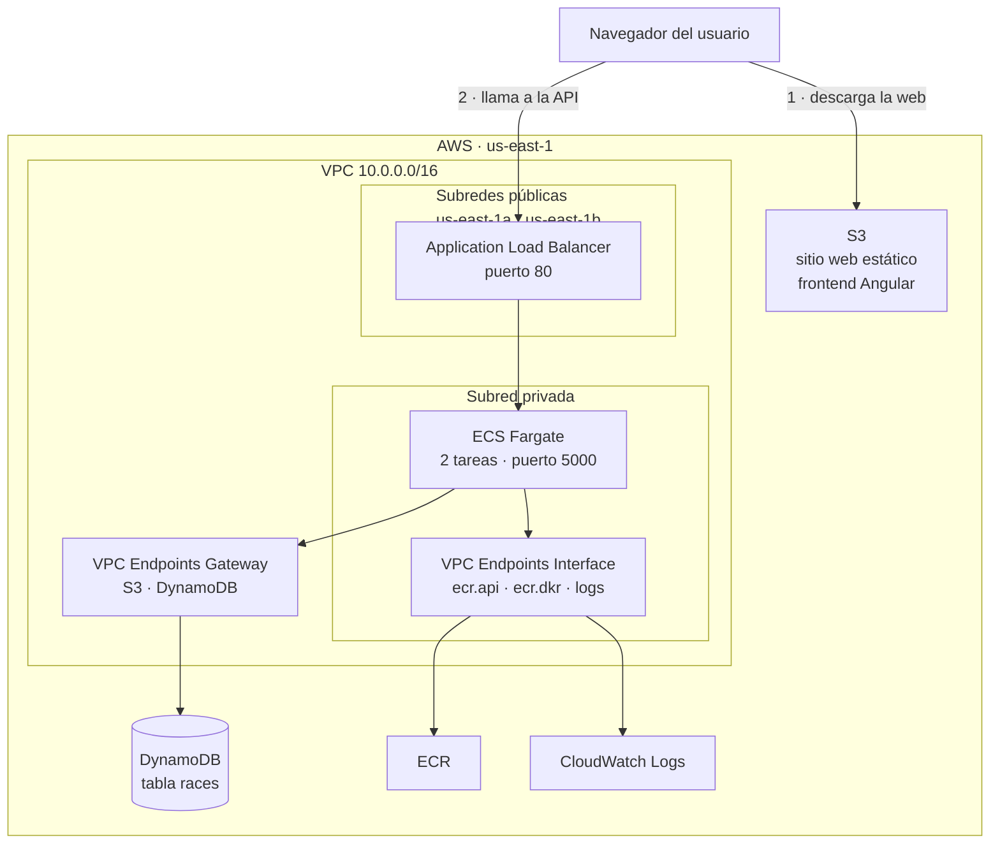

# Half Marathon Cloud Platform

## Memoria del proyecto

---

**Universitat Politècnica de Catalunya**

**Asignatura:** _(completar)_
**Titulación:** _(completar)_
**Curso académico:** 2025–2026

**Grupo 5**

| Integrante | Rol principal |
|---|---|
| Itzel Lorente | Infraestructura, contenedorización y despliegue |
| Miquel _(apellido)_ | Backend y desarrollo alternativo sobre EC2 |
| Òscar _(apellido)_ | Infraestructura inicial en Terraform |
| _(completar)_ | _(completar)_ |

**Repositorio:** https://github.com/group55-upc/half-marathon-cloud-platform

**Fecha de entrega:** _(completar)_

---

## Índice

1. [Introducción](#1-introducción)
2. [Objetivos y alcance](#2-objetivos-y-alcance)
3. [Arquitectura de la solución](#3-arquitectura-de-la-solución)
4. [Decisiones de diseño y desviaciones](#4-decisiones-de-diseño-y-desviaciones)
5. [Implementación](#5-implementación)
6. [Despliegue y automatización](#6-despliegue-y-automatización)
7. [Pruebas y validación](#7-pruebas-y-validación)
8. [Análisis de costes](#8-análisis-de-costes)
9. [Seguridad](#9-seguridad)
10. [Incidencias y resolución de problemas](#10-incidencias-y-resolución-de-problemas)
11. [Limitaciones y trabajo futuro](#11-limitaciones-y-trabajo-futuro)
12. [Conclusiones](#12-conclusiones)
13. [Reparto de trabajo](#13-reparto-de-trabajo)
14. [Referencias](#14-referencias)

---

## 1. Introducción

### 1.1 Contexto

El proyecto consiste en el diseño, implementación y despliegue de una plataforma web
*cloud-native* para la consulta de medias maratones. La aplicación permite buscar
carreras por distintos criterios, consultar su información y registrar carreras
nuevas.

Más allá de la funcionalidad, el propósito del trabajo es aplicar de forma práctica los
principios de la computación en la nube: separación de capas, infraestructura como
código, contenedorización, servicios gestionados y despliegue reproducible.

### 1.2 Motivación

El desarrollo se planteó como un ejercicio completo de ciclo de vida en la nube: partir
de un diseño, desplegarlo con herramientas de infraestructura como código, y operarlo
en un entorno real de AWS. Se optó deliberadamente por incorporar servicios que no se
habían tratado en las sesiones teóricas, con el objetivo de ampliar el alcance
formativo del trabajo.

### 1.3 Estructura de la memoria

Los apartados 2 a 6 describen qué se ha construido y cómo. El 7 documenta la
validación. Los apartados 8 a 11 recogen el análisis crítico del resultado: coste,
seguridad, incidencias reales y limitaciones. El 12 sintetiza las conclusiones.

---

## 2. Objetivos y alcance

### 2.1 Objetivos funcionales

| Nº | Objetivo | Estado |
|---|---|---|
| F1 | Consultar el catálogo de carreras desde una interfaz web | Completado |
| F2 | Buscar carreras por nombre y ciudad | Completado |
| F3 | Filtrar carreras por país | Completado |
| F4 | Filtrar carreras por distancia | Completado |
| F5 | Registrar carreras nuevas mediante formulario | Completado |
| F6 | Buscar carreras por fecha | **No implementado** |
| F7 | Visualizar el circuito de cada carrera | **No implementado** |

Los objetivos F6 y F7 formaban parte del planteamiento inicial y no se han alcanzado.
F7 requeriría además ampliar el backend para aceptar la subida de archivos, algo que no
se ha abordado.

### 2.2 Objetivos técnicos

| Nº | Objetivo | Estado |
|---|---|---|
| T1 | Arquitectura desacoplada en tres capas | Completado |
| T2 | Infraestructura definida íntegramente como código | Completado |
| T3 | Backend contenedorizado y ejecutado en un servicio gestionado | Completado |
| T4 | Backend no accesible directamente desde internet | Completado |
| T5 | Despliegue reproducible desde cero | Completado |
| T6 | Registro centralizado de logs | Completado |
| T7 | Integración continua | Completado |
| T8 | Comunicación cifrada de extremo a extremo | **No alcanzable** en el entorno de prácticas (ver 9.2) |
| T9 | Tolerancia al fallo de una zona de disponibilidad | Completado |
| T10 | Asistente conversacional con Amazon Bedrock | **No viable** en el entorno de prácticas (ver 5.5) |

### 2.3 Fuera de alcance

Se descartaron desde el inicio las funcionalidades marcadas como opcionales en el
planteamiento: funciones Lambda con EventBridge, análisis de vulnerabilidades con Trivy
y asistente conversacional con Amazon Bedrock.

---

## 3. Arquitectura de la solución

### 3.1 Visión general

La solución sigue una arquitectura de tres capas físicamente separadas, cada una
desplegada en un servicio distinto de AWS:



El navegador realiza dos tipos de petición independientes: descarga los archivos
estáticos desde S3 y, una vez la aplicación se está ejecutando en el cliente, invoca la
API a través del balanceador.

### 3.2 Capa de presentación

Aplicación Angular 22 compilada a archivos estáticos y servida desde un bucket de S3
configurado como sitio web. No existe servidor de aplicaciones: toda la lógica de
interfaz se ejecuta en el navegador del usuario.

El documento de error del bucket apunta también a `index.html`. Esto es necesario
porque en una aplicación de página única las rutas internas (`/dashboard`, `/add-race`)
no corresponden a archivos reales: S3 devuelve `index.html` y el enrutador de Angular
resuelve la ruta en el cliente.

### 3.3 Capa de aplicación

API REST en Node.js 24 con Express 5, empaquetada en una imagen Docker basada en
`node:24.16-alpine` y ejecutada como servicio de ECS con el modo de lanzamiento
Fargate. Dos tareas de 0,5 vCPU y 1 GB de memoria cada una.

Las tareas se ubican en una subred privada, sin dirección IP pública. El único punto de
entrada es un Application Load Balancer situado en las subredes públicas.

### 3.4 Capa de datos

Tabla de DynamoDB denominada `races`, con clave de partición `id` de tipo cadena y
facturación bajo demanda (`PAY_PER_REQUEST`). No se han definido índices secundarios.

El acceso desde el backend se realiza a través de un VPC endpoint de tipo Gateway, de
modo que el tráfico no abandona la red interna de AWS.

### 3.5 Diseño de red

| Elemento | Configuración |
|---|---|
| VPC | `10.0.0.0/16`, con soporte y nombres DNS habilitados |
| Subredes públicas | `10.0.0.0/24` (`us-east-1a`), `10.0.1.0/24` (`us-east-1b`) |
| Subredes privadas | `10.0.2.0/24` (`us-east-1a`), `10.0.3.0/24` (`us-east-1b`) |
| Tabla de rutas pública | `0.0.0.0/0` → Internet Gateway |
| Tabla de rutas privada | Sin ruta a internet |

Las subredes, tanto públicas como privadas, se despliegan una por zona de
disponibilidad. El servicio ECS recibe la lista completa de subredes privadas, de modo
que distribuye sus dos tareas entre ambas zonas: la redundancia protege del fallo de
una tarea y del fallo de una zona completa.

La decisión determinante es la ausencia de ruta a internet en la subred privada: no hay
Internet Gateway ni NAT Gateway asociados. El backend queda completamente aislado del
exterior.

Esto obliga a resolver por otra vía el acceso a los servicios de AWS que las tareas
necesitan, lo que motiva la incorporación de cinco VPC endpoints:

| Endpoint | Tipo | Función | Coste |
|---|---|---|---|
| `s3` | Gateway | Acceso a almacenamiento | Gratuito |
| `dynamodb` | Gateway | Acceso a la base de datos | Gratuito |
| `ecr.api` | Interface | Consulta al registro de imágenes | Facturado por hora |
| `ecr.dkr` | Interface | Descarga de la imagen del contenedor | Facturado por hora |
| `logs` | Interface | Envío de logs a CloudWatch | Facturado por hora |

Los de tipo Gateway se implementan como entradas en la tabla de rutas y no tienen
coste. Los de tipo Interface crean una interfaz de red real en la subred y se facturan
aunque no se utilicen, lo que tiene un impacto económico relevante analizado en el
apartado 8.

### 3.6 Modelo de seguridad de red

Los grupos de seguridad se encadenan por referencia mutua, no por rangos de
direcciones:

| Grupo | Puerto | Origen permitido |
|---|---|---|
| `ecs-alb-sg` | 80, 443 | `0.0.0.0/0` |
| `ecs-service-sg` | 5000 | Únicamente `ecs-alb-sg` |
| `vpc-endpoints-sg` | 443 | Únicamente `ecs-service-sg` |

El resultado es que el backend es inalcanzable desde internet incluso conociendo su
dirección IP privada: el balanceador es la única vía de entrada.

---

## 4. Decisiones de diseño y desviaciones

### 4.1 Desviaciones respecto al planteamiento inicial

El planteamiento original contemplaba React, PostgreSQL sobre Amazon RDS y
orquestación con EKS. La implementación final difiere en tres puntos:

| Previsto | Implementado |
|---|---|
| React + Vite | Angular 22 |
| PostgreSQL en Amazon RDS | DynamoDB |
| EKS + Kubernetes | ECS Fargate |

### 4.2 Justificación

La motivación principal fue **formativa**: trabajar con servicios de AWS no cubiertos
en las sesiones teóricas, en concreto un modelo de base de datos NoSQL y un servicio de
cómputo sin gestión de servidores.

A esta motivación se suman argumentos técnicos:

**ECS Fargate frente a EKS.** Fargate elimina por completo el aprovisionamiento,
parcheado y dimensionado de nodos de cómputo: se declara la CPU y la memoria que
requiere cada tarea y el proveedor se encarga del resto. Frente a EKS, reduce
drásticamente la complejidad operativa a cambio de un coste por hora superior y de una
menor portabilidad, ya que la definición de tareas de ECS es propietaria de AWS
mientras que los manifiestos de Kubernetes no lo son.

**DynamoDB frente a RDS.** DynamoDB es un servicio completamente gestionado, sin
instancias que administrar, con facturación por operación y latencia predecible. Su
modelo bajo demanda evita pagar capacidad reservada durante los periodos de
inactividad del proyecto.

### 4.3 Análisis crítico de la elección de DynamoDB

El desarrollo puso de manifiesto una limitación estructural que conviene documentar con
honestidad.

DynamoDB está optimizado para el acceso mediante clave. Con la tabla definida —clave de
partición `id` y sin índices secundarios— la única consulta eficiente es la
recuperación de una carrera concreta por su identificador. Las búsquedas previstas en
los objetivos funcionales (por ciudad, país o fecha) operan sobre atributos que no
forman parte de la clave, lo que obliga a utilizar la operación `Scan`.

`Scan` recorre la tabla completa y descarta después los elementos que no cumplen la
condición. Aplicar un `FilterExpression` **no reduce la lectura**, únicamente el
volumen de datos transferido. El coste y la latencia crecen linealmente con el tamaño
de la tabla.

Para el volumen del proyecto es irrelevante, pero se trata de una limitación de diseño,
no de implementación. En un escenario de producción con este patrón de acceso, dos
alternativas serían más adecuadas:

1. **Definir índices secundarios globales (GSI)** por los atributos consultados, lo que
   permitiría operaciones `Query` eficientes a cambio de coste de almacenamiento y
   escritura adicionales.
2. **Utilizar un modelo relacional**, que resuelve consultas multiatributo con índices
   convencionales de forma natural.

La conclusión es que un modelo relacional habría encajado mejor con el patrón de
acceso real de esta aplicación. La elección de DynamoDB se sostiene por su valor
formativo y por sus ventajas operativas, pero no por su adecuación al caso de uso.

### 4.4 Otras decisiones

**Filtrado en el cliente.** El frontend descarga el catálogo completo y aplica los
filtros en el navegador. Se obtiene así una respuesta instantánea al filtrar, a costa
de transferir todos los datos en la carga inicial. La decisión es coherente con la
limitación descrita en 4.3: dado que el filtrado en servidor requeriría `Scan` de todos
modos, no se pierde eficiencia.

**Despliegue en dos fases.** Descrito en el apartado 6.2.

**Amplify.** Se preparó un archivo `amplify.yml` para desplegar el frontend mediante
AWS Amplify, dentro de la misma intención de explorar servicios nuevos. No se llegó a
utilizar en el despliegue final: Amplify sirve el contenido exclusivamente por HTTPS, y
al no disponer el balanceador de un listener cifrado, el navegador bloquearía las
llamadas a la API por política de contenido mixto (ver 9.2).

## 5.5. Amazon Bedrock: análisis de viabilidad

El planteamiento inicial contemplaba, como funcionalidad opcional, un asistente
conversacional basado en Amazon Bedrock. Se evaluó su incorporación y se descartó por
tres impedimentos de naturaleza distinta, ninguno relacionado con la disponibilidad de
tiempo.

**Diseño previsto.** Una búsqueda en lenguaje natural: el usuario escribe *"medias
maratones en España en primavera"* y el sistema traduce la frase a los filtros
correspondientes. Habría requerido un endpoint `POST /assistant` en la API, la
dependencia `@aws-sdk/client-bedrock-runtime`, el permiso `bedrock:InvokeModel` en el
rol de tarea, y un componente de entrada de texto en el dashboard.

**Impedimento 1: permisos del rol de usuario.** La consulta del catálogo de modelos se
rechaza con `AccessDeniedException`, indicando que ninguna política autoriza la acción
`bedrock:ListFoundationModels`. Nótese la formulación: no hay denegación explícita,
sino ausencia de autorización. El servicio no forma parte del conjunto habilitado en el
entorno de prácticas.

**Impedimento 2: imposibilidad de auditar el rol de tarea.** El backend no se ejecuta
con el rol del usuario sino con `LabRole`, cuyos permisos podrían diferir. La consulta
de sus políticas revela cuatro políticas gestionadas de AWS —ninguna concede Bedrock— y
tres políticas propias del entorno cuyo contenido no puede inspeccionarse: la operación
`iam:GetPolicy` está denegada explícitamente. La verificación documental es por tanto
imposible.

**Impedimento 3: obstáculo arquitectónico.** Es el hallazgo más relevante, por ser
independiente de los permisos. Las tareas se ejecutan en una subred privada sin salida a
internet, y Bedrock —a diferencia de S3 y DynamoDB— no dispone de endpoint de tipo
Gateway. La integración exigiría un endpoint de tipo Interface adicional, con un coste
de 0,48 USD diarios en la configuración de dos zonas.

Como consecuencia, tampoco existe una prueba empírica económica: desde la subred privada
la invocación fracasaría por tiempo de espera de red con independencia de los permisos,
resultado indistinguible de una denegación. Determinar la causa real exigiría crear
previamente el endpoint y asumir su coste.

**Conclusión.** La funcionalidad se descarta por limitación del entorno y no por
decisión de alcance. Su incorporación en un entorno sin restricciones requeriría
habilitar el acceso al modelo en la cuenta, conceder el permiso de invocación al rol de
tarea, añadir el VPC endpoint correspondiente, e implementar el endpoint y el
componente descritos.

---

## 5. Implementación

### 5.1 Backend

API REST implementada con Express 5 y el SDK de AWS para JavaScript v3 (módulos
`@aws-sdk/client-dynamodb` y `@aws-sdk/lib-dynamodb`).

| Método | Ruta | Función |
|---|---|---|
| `GET` | `/` | Health check |
| `GET` | `/connection` | Verifica la conectividad con DynamoDB |
| `GET` | `/races` | Devuelve el catálogo completo |
| `GET` | `/races?id=<id>` | Recupera una carrera por clave (`GetCommand`) |
| `GET` | `/races?<campo>=<valor>` | Filtra por coincidencia exacta (`ScanCommand`) |
| `POST` | `/races` | Crea una carrera (`PutCommand`) |

El código distingue correctamente los dos modos de lectura: cuando el único parámetro
es `id` utiliza `GetCommand`, que es una consulta directa por clave; en cualquier otro
caso recurre a `ScanCommand`.

Se contempla la paginación de DynamoDB: el servicio devuelve como máximo 1 MB por
respuesta, y el backend itera con `ExclusiveStartKey` hasta agotar los resultados.

El identificador de cada carrera se genera combinando la marca de tiempo con un número
aleatorio. Es suficiente para el volumen del proyecto, aunque un UUID ofrecería
garantías formales de unicidad.

No se han implementado operaciones de modificación ni de borrado: el CRUD está
incompleto.

### 5.2 Frontend

Aplicación Angular 22 con componentes *standalone* y gestión de estado mediante
*signals*, el modelo reactivo introducido en las versiones recientes del framework.

| Componente | Ruta | Función |
|---|---|---|
| `DashboardComponent` | `/dashboard` | Listado, buscador, filtros y estadísticas |
| `AddRaceComponent` | `/add-race` | Formulario de registro con validación |
| `RaceService` | — | Encapsula las llamadas HTTP a la API |

El dashboard calcula mediante propiedades derivadas (`computed`) tanto la lista
filtrada como las estadísticas mostradas (total de carreras, distancia media y país más
frecuente), que se recalculan automáticamente al cambiar cualquier filtro.

El formulario valida los seis campos antes de enviar, incluida la comprobación de que
la URL proporcionada es sintácticamente válida. Esta validación reside únicamente en el
cliente, lo que se analiza en el apartado 9.2.

### 5.3 Base de datos

Tabla `races` con la siguiente estructura de elementos:

| Atributo | Tipo | Descripción |
|---|---|---|
| `id` | Cadena | Clave de partición, generada por el backend |
| `name` | Cadena | Nombre de la carrera |
| `city` | Cadena | Ciudad |
| `country` | Cadena | País |
| `date` | Cadena | Fecha en formato `YYYY-MM-DD` |
| `distance` | Número | Distancia en kilómetros |

DynamoDB no impone esquema: la coherencia de la estructura la garantiza el código del
backend, no el motor de base de datos.

Los archivos `database/schema.sql` y `database/seed.sql` corresponden al modelo
relacional del diseño inicial y se conservan como documentación de esa fase del
proyecto. No son ejecutables sobre DynamoDB.

### 5.4 Infraestructura como código

La totalidad de la infraestructura está definida en Terraform, en `backend/infra/`. El
despliegue crea **27 recursos**:

| Categoría | Recursos |
|---|---|
| Red | 1 VPC, 3 subredes, 1 Internet Gateway, 2 tablas de rutas, 3 asociaciones |
| Endpoints | 2 de tipo Gateway, 3 de tipo Interface |
| Seguridad | 3 grupos de seguridad |
| Datos | 1 tabla DynamoDB |
| Registro | 1 repositorio ECR |
| Cómputo | 1 cluster, 1 definición de tarea, 1 servicio ECS |
| Balanceo | 1 ALB, 1 target group, 1 listener |
| Almacenamiento | 1 bucket S3 con configuración de sitio web, política y control de acceso |

El estado de Terraform se mantiene en un archivo local, no en un backend remoto
compartido. La consecuencia operativa se analiza en el apartado 8.3.

---

## 6. Despliegue y automatización

### 6.1 Proceso

El despliegue completo comprende ocho fases:

| Fase | Acción |
|---|---|
| 1 | Verificación de herramientas (AWS CLI, Terraform, Docker, Node.js) |
| 2 | Verificación de credenciales de AWS |
| 3 | Creación de la infraestructura base con Terraform |
| 4 | Construcción de la imagen Docker y publicación en ECR |
| 5 | Creación del cluster y el servicio ECS |
| 6 | Espera activa hasta que el backend responde |
| 7 | Compilación del frontend y publicación en S3 |
| 8 | Carga de datos de ejemplo |

### 6.2 La dependencia entre imagen y servicio

El proceso presenta una dependencia que Terraform no puede resolver por sí solo: el
servicio ECS necesita que la imagen exista en ECR antes de arrancar, pero la imagen se
construye y publica con Docker, fuera del ámbito de Terraform.

Si se ejecuta un único `terraform apply`, el servicio se crea antes de que la imagen
esté disponible y las tareas fallan con `CannotPullContainerError`.

La solución adoptada consiste en dividir el despliegue en dos fases, controladas por la
variable `enable-ECS`:

```
Fase 1  enable-ECS = false   → red, DynamoDB, ECR, S3, ALB, grupos de seguridad
        docker build + push  → la imagen queda disponible en el registro
Fase 2  enable-ECS = true    → cluster, definición de tarea y servicio
```

Es una solución funcional pero manual. Alternativas más limpias serían separar la
infraestructura en dos estados de Terraform independientes (base y aplicación), que es
la práctica habitual en entornos productivos.

### 6.3 Automatización

Se ha desarrollado el script `deploy.ps1`, que ejecuta las ocho fases de forma
desatendida. Sus características relevantes:

- **Verificación previa.** Comprueba herramientas y credenciales antes de crear nada,
  de modo que un problema de configuración se detecta en segundos en lugar de a mitad
  del despliegue.
- **Comprobación del código de retorno de cada comando**, no del canal de error
  estándar. Muchas herramientas escriben avisos inocuos por dicho canal.
- **Espera activa.** Sondea el balanceador cada 15 segundos, hasta un máximo de 10
  minutos, antes de continuar con el frontend.
- **Inyección automática de la URL del balanceador** en el código del frontend, dado
  que dicha dirección cambia en cada despliegue.
- **Verificación integrada.** Comprueba que la compilación del frontend no contiene
  código fuente antes de publicarla.
- **Fallo seguro.** Si aborta, no destruye lo ya creado: permite corregir y reintentar.

También se ha desarrollado `database/seed-races.ps1`, que carga un conjunto de carreras
de ejemplo mediante llamadas a la API. Es el equivalente funcional del `seed.sql` del
diseño relacional inicial.

### 6.4 Integración continua y despliegue

El repositorio incorpora dos pipelines de GitHub Actions con responsabilidades
deliberadamente separadas.

**`ci.yml`, automático.** Se ejecuta en cada `push` a `main` y en cada *pull request*.
No requiere credenciales de AWS, por lo que funciona siempre. Comprende tres trabajos en
paralelo: validación de la configuración de Terraform, compilación del frontend, y
construcción de la imagen del backend con análisis de vulnerabilidades mediante Trivy.

Incorpora una **guarda de regresión**: tras compilar el frontend cuenta los archivos
`.ts` presentes en la salida y falla si encuentra alguno. El defecto documentado en el
apartado 11.6 —la publicación de código fuente en un bucket público— no puede por tanto
reaparecer sin que la integración continua lo bloquee. Es un ejemplo de cómo un defecto
corregido se convierte en una garantía permanente.

**`deploy.yml`, de disparo manual.** Despliega la aplicación sobre una infraestructura
existente: publica la imagen en el registro, fuerza el redespliegue del servicio, espera
a que la API responda, y compila y publica el frontend inyectando la dirección del
balanceador.

Etiqueta la imagen con dos referencias: `v1.0`, que es la que la definición de tarea
referencia de forma fija, y el hash abreviado del commit. Esto último resuelve
parcialmente la limitación de trazabilidad de versiones señalada en el apartado 12.2.

**Justificación del disparo manual.** Dos razones de carácter estructural:

1. **Credenciales temporales.** Las del entorno de prácticas caducan cada pocas horas,
   de modo que un despliegue automático en cada cambio fallaría la mayor parte del
   tiempo.
2. **Estado local de la infraestructura.** El pipeline no tiene acceso al estado de
   Terraform, por lo que no puede crear ni modificar infraestructura. Localiza los
   recursos existentes consultando la API del proveedor en lugar de leer los valores de
   salida de Terraform.

La segunda razón constituye además una separación de responsabilidades adecuada: el
pipeline despliega la aplicación, mientras que el aprovisionamiento de la
infraestructura se realiza de forma independiente. Conviene señalar que la aprobación
manual de los despliegues es práctica habitual en entornos productivos, por lo que el
disparo manual no debe interpretarse como una carencia, sino como una decisión
justificada por las circunstancias del entorno.

### 6.5 Resultado medido

Ejecución completa desde infraestructura inexistente:

| Métrica | Valor |
|---|---|
| Recursos creados | 27 |
| Tiempo de creación del balanceador | 3 min 5 s |
| Tiempo total del primer despliegue | ~12 min |
| Tiempo de un redespliegue con infraestructura existente | **2,2 min** |
| Carreras cargadas | 12 de 12, sin errores |

El balanceador es con diferencia el recurso más lento de aprovisionar: 3 minutos frente
a segundos del resto. Este dato refuerza el argumento del apartado 6.2 a favor de
separar la infraestructura en dos estados, ya que cada operación sobre la fase base
implica esperar ese tiempo.

---

## 7. Pruebas y validación

### 7.1 Validación funcional

| Prueba | Método | Resultado |
|---|---|---|
| Disponibilidad del backend | `GET /` sobre el balanceador | `{"status":"ok"}` |
| Conectividad con la base de datos | `GET /connection` | `{"status":"ok"}` |
| Creación de carreras | 12 peticiones `POST /races` | 12 correctas, 0 fallidas |
| Lectura del catálogo | `GET /races` | 12 elementos |
| Carga de la interfaz | Navegador sobre la URL de S3 | Correcta |
| Integración extremo a extremo | Indicador *Service Online* en la interfaz | Activo |
| Búsqueda por nombre y ciudad | Interfaz | Correcta |
| Filtrado por país y distancia | Interfaz | Correcto |
| Registro desde formulario | Interfaz | Correcto |

La verificación más significativa es el indicador *Service Online*: se alimenta de una
llamada real del navegador a la API, de modo que su activación confirma
simultáneamente que las tres capas se comunican correctamente.

### 7.2 Verificación de correcciones

Durante la fase final se detectaron y corrigieron dos defectos, verificados
posteriormente:

| Defecto | Verificación | Resultado |
|---|---|---|
| Publicación de código fuente en el bucket público | Búsqueda de archivos `.ts` en la compilación | Ninguno (antes: 7) |
| Filtrado numérico inoperativo en la API | `GET /races?distance=42.195` | Devuelve resultados (antes: `race not found`) |

### 7.3 Pruebas no realizadas

No existen pruebas automatizadas. El entorno de pruebas (`vitest`) está instalado en el
frontend y hay un archivo de especificación generado por el andamiaje de Angular, pero
sin casos implementados.

Tampoco se han realizado pruebas de carga ni de resistencia, por lo que no se dispone
de datos sobre el comportamiento del sistema con volúmenes elevados de datos o de
peticiones concurrentes.

---

## 8. Análisis de costes

### 8.1 Desglose

Estimación para la región `us-east-1` con la infraestructura desplegada e inactiva,
basada en precios públicos de referencia:

| Recurso | Coste diario | Coste mensual |
|---|---|---|
| 3 VPC endpoints de tipo Interface, en 2 zonas | 1,44 USD | ~44 USD |
| 2 tareas Fargate (1 vCPU y 2 GB en total) | 1,20 USD | ~36 USD |
| Application Load Balancer | 0,54 USD | ~16 USD |
| DynamoDB (bajo demanda), S3, ECR, endpoints Gateway | céntimos | ~1 USD |
| **Total** | **~3,12 USD** | **~97 USD** |

El gasto principal no es el cómputo ni el balanceo, sino la **conectividad privada**.
Los endpoints de tipo Interface se facturan por zona de disponibilidad, de modo que al
desplegar el backend en dos zonas su coste se duplica: de 0,72 a 1,44 USD diarios.

**El cumplimiento de la tolerancia al fallo de zona tiene por tanto un precio
cuantificado de 0,72 USD diarios**, un 30 % sobre la factura previa. Fargate no
encarece, porque se paga por tarea con independencia de su ubicación; el sobrecoste
procede íntegramente de duplicar las interfaces de red de los endpoints.

### 8.2 Observaciones

**Los VPC endpoints de tipo Interface son el segundo gasto en importancia**, casi al
nivel del balanceador, y constituyen un coste habitualmente ignorado porque no
corresponden a ningún componente visible de la aplicación. Su existencia es consecuencia
directa de la decisión de aislar completamente la subred privada.

Existe por tanto un compromiso explícito entre aislamiento de red y coste: ubicar las
tareas en la subred pública con dirección IP pública eliminaría la necesidad de los
tres endpoints, ahorrando aproximadamente 22 USD mensuales, a cambio de exponer las
tareas a internet. Se ha priorizado el aislamiento.

**Detener la sesión del laboratorio no interrumpe la facturación.** Los laboratorios de
AWS Academy detienen automáticamente las instancias EC2 al finalizar la sesión, pero la
arquitectura de este proyecto no utiliza EC2: Fargate, el balanceador y los VPC
endpoints continúan operativos y facturando. Únicamente `terraform destroy` lleva el
consumo a cero.

Esta circunstancia se descubrió durante el desarrollo y motivó la incorporación de
avisos explícitos en la documentación y en la salida del script de despliegue.

### 8.3 Implicación del estado local de Terraform

El estado de Terraform se mantiene en un archivo local en el equipo de cada integrante.
En consecuencia, cada despliegue genera una infraestructura completamente
independiente, y varios despliegues simultáneos multiplican el coste.

A ello se añade una restricción técnica: el nombre del bucket de S3 está fijado en el
código, y los nombres de bucket son únicos a escala global en AWS, no por cuenta. Solo
un integrante del equipo puede mantener la infraestructura desplegada en un momento
dado.

La solución sería incorporar el identificador de cuenta al nombre del bucket y, para el
estado, utilizar un backend remoto compartido con bloqueo.

---

## 9. Seguridad

### 9.1 Medidas implementadas

- **Aislamiento del backend.** Las tareas se ejecutan en una subred privada sin
  dirección IP pública y sin ruta a internet.
- **Encadenamiento de grupos de seguridad por referencia** en lugar de por rangos de
  direcciones, de modo que cada capa solo acepta tráfico de la inmediatamente anterior.
- **Tráfico interno por la red privada de AWS.** El acceso a DynamoDB, ECR y CloudWatch
  se realiza mediante VPC endpoints, sin salir a internet.
- **Contenedor sin privilegios.** El `Dockerfile` incluye la directiva `USER node`, de
  modo que el proceso no se ejecuta como superusuario.
- **Ausencia de credenciales en el código.** El acceso a DynamoDB se obtiene del rol de
  IAM asociado a la tarea.

### 9.2 Deficiencias identificadas

**Ausencia de cifrado en tránsito.** Es la deficiencia principal. Los endpoints de
sitio web estático de S3 no admiten HTTPS y el balanceador únicamente dispone de un
listener en el puerto 80. La totalidad del tráfico circula sin cifrar.

Las dos mitades del problema están acopladas: servir el frontend por HTTPS sin hacer lo
mismo con la API provocaría que el navegador bloqueara todas las llamadas por política
de contenido mixto. La solución requiere ambas piezas simultáneamente: CloudFront
delante del bucket y un certificado de ACM en el balanceador. La validación de un
certificado de ACM exige el control de un dominio propio, no disponible en el entorno
de prácticas, por lo que la deficiencia se documenta como limitación asumida.

**Política CORS permisiva.** La directiva `app.use(cors())` sin parámetros autoriza
peticiones desde cualquier origen. Debería restringirse al dominio del frontend.

**Ausencia de autenticación.** La API es pública y cualquiera puede crear carreras. El
`package.json` incluye la dependencia `jsonwebtoken` y el código contiene comentarios
que prevén la gestión de usuarios, pero no está implementada.

**Validación exclusivamente en el cliente.** El backend no valida el cuerpo de las
peticiones. La validación del formulario es evitable invocando la API directamente, lo
que permitiría crear registros con campos vacíos o tipos incorrectos.

**Rol de IAM excesivamente amplio.** Tanto el rol de ejecución como el de tarea apuntan
a `LabRole`, un rol preexistente del laboratorio con permisos amplios. Cumplen
funciones distintas y en un entorno real serían dos roles independientes con el mínimo
privilegio necesario. Esta dependencia implica además que el proyecto no es portable a
una cuenta de AWS convencional sin modificaciones.

---

## 10. Incidencias y resolución de problemas

Este apartado documenta las incidencias reales encontradas durante el despliegue y su
diagnóstico, por su valor como registro del proceso de trabajo.

### 10.1 `CannotPullContainerError` al arrancar las tareas

**Síntoma.** Tras el primer `terraform apply`, las tareas del servicio ECS fallaban
repetidamente sin llegar a arrancar.

**Diagnóstico.** El servicio se había creado antes de que la imagen del contenedor
existiera en ECR, de modo que las tareas no encontraban nada que ejecutar.

**Resolución.** División del despliegue en dos fases mediante la variable `enable-ECS`
(apartado 6.2). Una vez publicada la imagen, forzar un nuevo despliegue del servicio
levantó las dos tareas correctamente.

### 10.2 Frontend apuntando a un balanceador inexistente

**Síntoma.** La interfaz cargaba pero no mostraba datos.

**Diagnóstico.** La URL del balanceador está escrita en el código fuente del frontend,
y el valor almacenado en el repositorio correspondía a un despliegue anterior ya
destruido. El nombre DNS de un ALB lo asigna AWS y cambia en cada creación.

**Resolución.** Actualización manual del valor y, posteriormente, automatización de la
inyección de la URL en el script de despliegue. La solución de fondo —externalizar la
configuración a un archivo leído en tiempo de ejecución— queda documentada como mejora
pendiente.

### 10.3 Credenciales anuladas del laboratorio

**Síntoma.** `terraform destroy` fallaba con errores de autorización simultáneos en
todos los servicios, indicando una denegación explícita por parte de la política
`voc-cancel-cred`.

**Diagnóstico.** La sesión del laboratorio se había detenido, lo que anula las
credenciales aunque los recursos sigan existiendo y facturando.

**Resolución.** Reiniciar la sesión del laboratorio y renovar las credenciales. La
incidencia evidenció que **detener la sesión no detiene el gasto**, hallazgo recogido
en el apartado 8.2.

### 10.4 Error 400 en la autenticación contra ECR

**Síntoma.** El comando de autenticación contra ECR fallaba con `400 Bad Request`
únicamente al ejecutarse desde el script, y no de forma interactiva.

**Diagnóstico.** PowerShell termina las líneas con la secuencia `\r\n` al canalizar la
salida de un programa hacia otro. Docker elimina el carácter `\n` pero conserva el
`\r`, de modo que el token de autenticación llegaba con un carácter adicional y el
registro rechazaba la cabecera como malformada.

**Resolución.** Sustituir la canalización por el paso del token como argumento, previa
eliminación de espacios en blanco, con un método alternativo de reserva delegando la
canalización al intérprete de comandos del sistema.

### 10.5 Conexión rechazada al abrir el sitio web

**Síntoma.** El navegador devolvía `ERR_CONNECTION_RESET` al acceder a la URL del sitio
web de S3, mientras que la misma petición desde línea de comandos devolvía un código
200.

**Diagnóstico.** El navegador promocionaba automáticamente la conexión a HTTPS, y los
endpoints de sitio web estático de S3 no admiten dicho protocolo, por lo que no había
servicio escuchando en el puerto seguro.

**Resolución.** Acceder explícitamente por HTTP. La incidencia condujo al análisis del
problema de contenido mixto documentado en el apartado 9.2.

### 10.6 Defectos de código detectados en la revisión final

| Defecto | Análisis | Estado |
|---|---|---|
| Publicación de código fuente en el bucket público | La configuración de `assets` en `angular.json` copiaba la totalidad del directorio `src` a la salida de compilación, incluyendo los archivos `.ts`, que quedaban accesibles en el bucket público | Corregido |
| Filtrado numérico inoperativo | Una sentencia que calculaba la conversión de tipo sin asignar el resultado provocaba que los valores numéricos se enviaran a DynamoDB como cadenas, sin coincidir nunca con los números almacenados | Corregido |
| Caché del compilador versionada en el repositorio | El directorio `.angular/cache` estaba bajo control de versiones, generando miles de líneas de diferencias espurias en cada compilación | Corregido |

---

## 11. Limitaciones y trabajo futuro

### 11.1 Limitaciones funcionales

- No se ha implementado la búsqueda por fecha (objetivo F6).
- No se ha implementado la visualización del circuito (objetivo F7), que requeriría
  ampliar el backend para admitir subida de archivos.
- El CRUD está incompleto: no existen operaciones de modificación ni de borrado.
- Las carreras se presentan en el orden arbitrario en que las devuelve DynamoDB, sin
  ordenación por fecha.

### 11.2 Limitaciones técnicas

- Ausencia de cifrado en tránsito (apartado 9.2).
- No se ha integrado Amazon Bedrock, por las tres razones expuestas en el apartado 5.5.
- Las búsquedas se resuelven mediante `Scan`, sin índices secundarios (apartado 4.3).
- Ausencia de paginación en la API y en la interfaz.
- La definición de tarea referencia la etiqueta `v1.0` de forma fija. El pipeline de
  despliegue publica además la imagen con el hash del commit, lo que aporta
  trazabilidad, pero la referencia de la definición sigue siendo estática.
- El estado de Terraform es local, sin backend compartido ni bloqueo. Es también lo que
  impide que el pipeline gestione la infraestructura y no solo la aplicación.
- El despliegue automatizado es de disparo manual, no continuo (apartado 6.4).
- Dependencia del rol `LabRole`, exclusivo de los laboratorios de AWS Academy.
- Ausencia de pruebas automatizadas.

### 11.3 Líneas de trabajo futuro

Por orden de prioridad estimada:

| Línea | Actuación | Complejidad |
|---|---|---|
| Cifrado extremo a extremo | CloudFront ante el bucket y certificado de ACM en el balanceador | Alta (requiere dominio propio) |
| Despliegue continuo | Backend remoto para el estado y credenciales no temporales | Media |
| Asistente con Bedrock | Habilitar el servicio, conceder el permiso y añadir el VPC endpoint | No viable en el entorno de prácticas |
| Externalizar la configuración | Archivo de configuración leído en tiempo de ejecución | Baja |
| Búsquedas eficientes | Índices secundarios globales y paginación | Media |
| Autenticación | Amazon Cognito o JWT con la dependencia ya presente | Media |
| Integración continua | Implementar el pipeline: construcción, análisis con Trivy, publicación | Media |
| Pruebas automatizadas | Casos de prueba en el frontend y en la API | Baja |
| Trazabilidad de versiones | Etiquetar la imagen con el hash del commit | Baja |
| Completar el CRUD | Métodos `PUT` y `DELETE` | Baja |

El análisis detallado de cada punto, con el código concreto de la solución y la
estimación de esfuerzo, se encuentra en `docs/mejoras-propuestas.md`.

---

## 12. Conclusiones

**Sobre el resultado.** La plataforma está desplegada y operativa, con las tres capas
comunicándose correctamente y un despliegue reproducible desde cero en poco más de dos
minutos sobre infraestructura existente. Se han alcanzado cinco de los siete objetivos
funcionales y seis de los ocho técnicos.

**Sobre la infraestructura como código.** Definir la totalidad de la infraestructura en
Terraform ha sido determinante. Ha permitido destruir y recrear el entorno completo
varias veces sin degradación, lo que a su vez ha hecho viable controlar el coste
destruyendo los recursos entre sesiones de trabajo. Un entorno creado manualmente no
habría permitido esa disciplina.

**Sobre las decisiones de arquitectura.** El aislamiento del backend en una subred
privada sin salida a internet es sólido desde el punto de vista de seguridad, pero
tiene un coste económico concreto y cuantificado: los tres VPC endpoints de tipo
Interface necesarios para suplir esa falta de conectividad suponen aproximadamente el
30 % del gasto total. Los compromisos de arquitectura no son abstractos, aparecen en la
factura.

**Sobre la elección de DynamoDB.** El análisis del apartado 4.3 constituye, en
retrospectiva, el aprendizaje más valioso del proyecto. La decisión estaba
correctamente motivada desde el punto de vista formativo, pero el patrón de acceso de
la aplicación —búsquedas por múltiples atributos que no forman parte de la clave— no es
el que DynamoDB resuelve bien. Elegir una tecnología por lo que se quiere aprender es
legítimo; comprobar después si encajaba con el problema es lo que convierte la elección
en conocimiento.

**Sobre el proceso.** Las incidencias documentadas en el apartado 10 no fueron
obstáculos accesorios, sino la parte donde se produjo el aprendizaje real: el orden de
las dependencias en un despliegue, el ciclo de vida de las credenciales temporales, el
comportamiento de las tuberías entre procesos, y la diferencia entre detener una sesión
y detener una infraestructura.

**Sobre las limitaciones asumidas.** La ausencia de cifrado en tránsito es la carencia
más relevante y no es subsanable en el entorno de prácticas por la imposibilidad de
validar un certificado sin un dominio propio. Se documenta de forma explícita, junto
con la arquitectura que la resolvería, por entender que identificar una limitación y
saber cómo se corregiría aporta más que omitirla.

---

## 13. Reparto de trabajo

| Integrante | Aportación |
|---|---|
| Itzel Lorente | Despliegue de la infraestructura con Terraform, contenedorización y publicación de la imagen en ECR, despliegue del servicio en ECS, publicación del frontend en S3, automatización del despliegue completo (`deploy.ps1`), carga de datos (`seed-races.ps1`), revisión técnica del repositorio y documentación de arquitectura |
| Miquel _(apellido)_ | _(completar)_ Desarrollo del backend, y una implementación individual alternativa y completa sobre EC2 (`Miquel/`) |
| Òscar _(apellido)_ | _(completar)_ Exploración inicial de la infraestructura en Terraform (`oscar/`) |
| _(completar)_ | _(completar)_ |

_(Nota: completar con los nombres y las aportaciones reales de cada integrante antes de
la entrega.)_

---

## 14. Referencias

- Amazon Web Services. *Amazon ECS Developer Guide*. https://docs.aws.amazon.com/ecs/
- Amazon Web Services. *AWS Fargate*. https://docs.aws.amazon.com/AmazonECS/latest/developerguide/AWS_Fargate.html
- Amazon Web Services. *Amazon DynamoDB Developer Guide*. https://docs.aws.amazon.com/dynamodb/
- Amazon Web Services. *Website endpoints — Amazon S3 User Guide*. https://docs.aws.amazon.com/AmazonS3/latest/userguide/WebsiteEndpoints.html
- Amazon Web Services. *AWS PrivateLink and VPC endpoints*. https://docs.aws.amazon.com/vpc/latest/privatelink/
- Amazon Web Services. *Elastic Load Balancing — Application Load Balancers*. https://docs.aws.amazon.com/elasticloadbalancing/
- HashiCorp. *Terraform AWS Provider Documentation*. https://registry.terraform.io/providers/hashicorp/aws/latest/docs
- Angular. *Angular Documentation*. https://angular.dev
- Docker. *Dockerfile reference*. https://docs.docker.com/reference/dockerfile/

### Documentación interna del proyecto

- `README.md` — Descripción general y procedimiento de despliegue
- `docs/architecture.md` — Arquitectura técnica detallada
- `docs/mejoras-propuestas.md` — Análisis de mejoras con solución y estimación
- `backend/README.md` — Procedimiento manual de despliegue y pruebas en local
